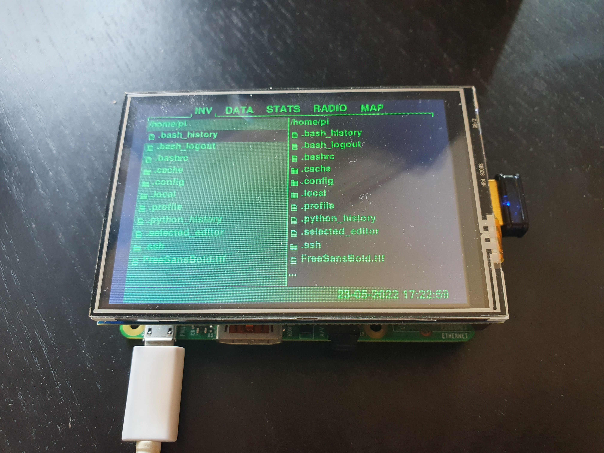

PiBoy
=========================
[](https://github.com/SirLefti/piboy)
[](https://github.com/SirLefti/piboy)

Build your own Pip-Boy with some useful features for real-life using your Raspberry Pi.

## Hardware

 - Raspberry Pi (any full size board should work)
 - 3.5" SPI display module (with an ILI9486 display driver chip)

## Installation

Install system dependencies:
````bash
sudo apt install build-essential git usbmount python3 python3-dev python3-smbus python3-venv fonts-freefont-ttf libjpeg-dev libatlas-base-dev libopenjp2-7-dev
````

Make sure the following entry in ``/lib/systemd/system/systemd-udevd.service`` matches and reboot after changes:
````bash
PrivateMount=no
````

Clone repository and go into it:
````bash
git clone https://github.com/SirLefti/piboy
cd piboy
````

Create a virtual environment:
````bash
python -m venv .venv
````

Install python dependencies:
````bash
.venv/bin/pip install -r requirements.txt
````

Edit the crontab with ``crontab -e`` and add the following:
````bash
@reboot cd /home/pi/piboy && .venv/bin/python piboy.py &
````

To enable logging, use the following instead:
````bash
@reboot cd /home/pi/piboy && (.venv/bin/python -u piboy.py >log 2>err) &
````

## Configuration

Most config stuff is defined in the equally named file ``config.py``. However, the apps are configured in ``piboy.py``
to avoid circular imports. The same applies to the interface (the way how the Pi-Boy shows the UI) and input
configuration (the way how the Pi-Boy reads the user input). ``TkInterface`` can be used for development and simulation
purposes without a Raspberry Pi. It implements both ``BaseInterface`` and ``BaseInput`` and thus should be used as
interface and input. On a Raspberry Pi use ``ILI9486Interface`` and ``GPIOInput``.

This project uses FreeSansBold as default font. If the font cannot be found despite being installed, or you do not want
to install it, place the ``FreeSanBold.ttf`` in the root directory as a workaround.

## Roadmap

* [x] display driver
* [x] project base
* [ ] build documentation / guide
* [ ] case
* [x] file manager app
* [ ] map app
* [ ] radio app
* [ ] other apps (?)
* [ ] utilities
