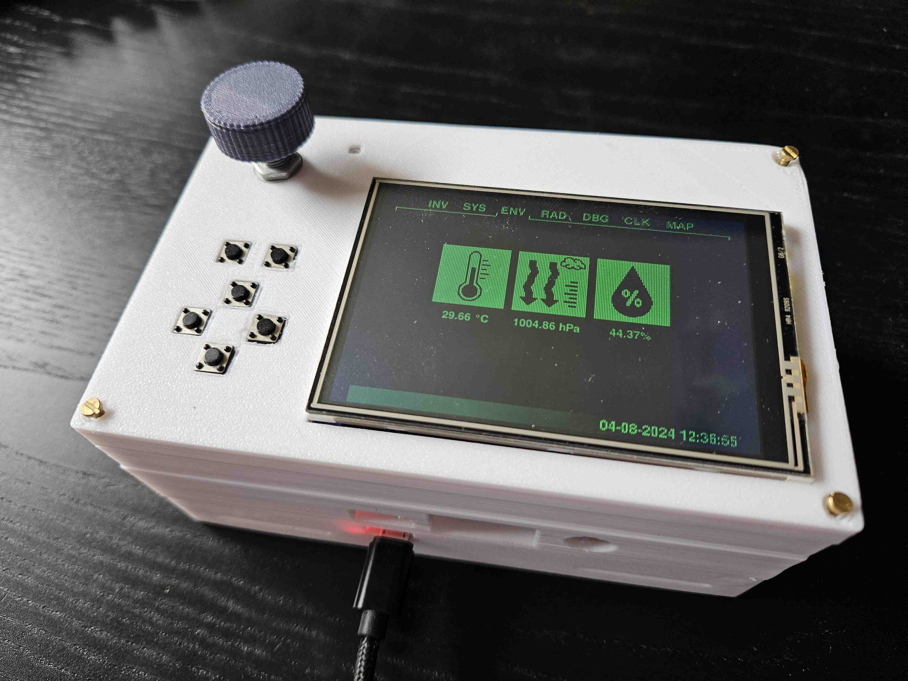
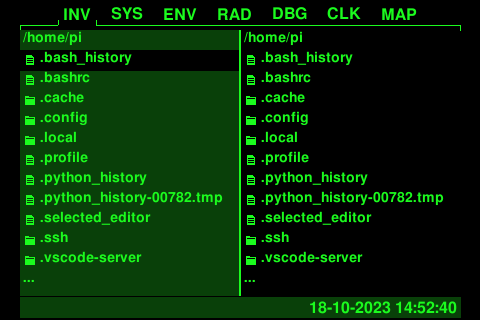
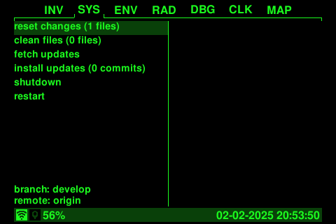
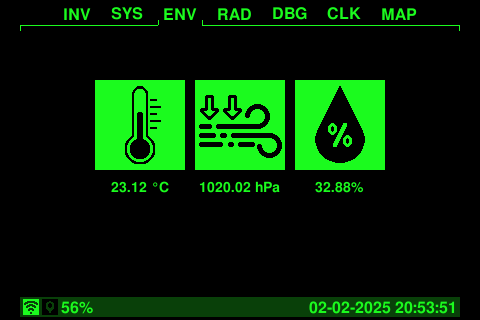
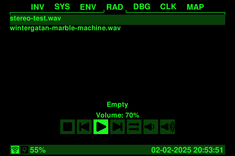
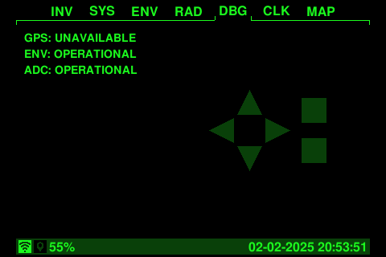
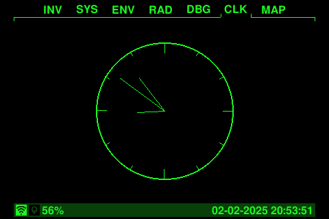
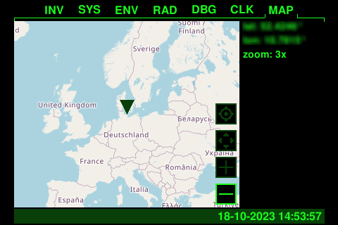

PiBoy
=========================
[](https://github.com/SirLefti/piboy)
[](https://github.com/SirLefti/piboy)
[](https://github.com/SirLefti/piboy)
<br>
[](https://github.com/SirLefti/piboy/tree/develop)
[](https://github.com/SirLefti/piboy/tree/develop)
[](https://github.com/SirLefti/piboy/tree/develop)


Build your own Pip-Boy with some useful features for real-life using your Raspberry Pi.

## Features

#### File Manager App
Provides basic functions for moving, copying and deleting files and directories. Plug in a USB drive as a holo tape.



#### System App
Can fetch and install updates from the git repository.



#### Environment App
Provides useful information about your environment like temperature, atmospheric pressure and humidity.



#### Radio App
Actually more like a classic music player. Stay tuned!



#### Debug App
Shows the last pressed key to help you check the key wiring.



#### Clock App
It just shows the time on a classic analog clock.



#### Map App
Supports zooming and moving the map around. Don't get lost in the wasteland.



## Hardware

Base:
- Raspberry Pi (full size board with all 40 pins recommended)
- 3.5" SPI display module (with an ILI9486 display driver chip)
- rotary encoder module (KY-040)
- 6x micro push buttons (6mm x 6mm)
- perf board/proto board (14x9 holes required)
- wires, general soldering stuff
- rotary encoder knob (optional, choose one you like)
- USB Wi-Fi adapter (optional, if your Pi does not have Wi-Fi onboard)

Modules:
- BME280 environment sensor
- NEO-6M GPS module
- DS3231 RTC clock (optional, but recommended)

Battery power:
- MT3608 power converter
- TP4056 battery charging controller
- 18650 battery cell (others can fit as well)
- toggle switch

Additional parts depending on case version. Battery power and modules are not supported internally by prototype 1.

## Installation

All guides are using Raspberry OS based on Debian Bookworm.

Install system dependencies:
````bash
sudo apt install git libopenjp2-7 libportaudio2 libopenblas0 python3-rpi-lgpio font-freefont-ttf
````

Call ``sudo raspi-config`` and then select ``Interface Options > SPI`` to enable SPI.
Then select ``Interface Options > I2C`` to enable I2C.

Clone repository and go into it:
````bash
git clone https://github.com/SirLefti/piboy
cd piboy
````

Create a virtual environment:
````bash
python -m venv .venv
````

Install python dependencies:
````bash
.venv/bin/pip install -r requirements-pi.txt
````

Edit the crontab with ``crontab -e`` and add the following:
````bash
@reboot cd /home/pi/piboy && .venv/bin/python piboy.py &
````

To enable logging, use the following instead:
````bash
@reboot cd /home/pi/piboy && (.venv/bin/python -u piboy.py >log 2>err) &
````

## Configuration

On first run, the PiBoy script will create a ``config.yaml`` if not found. In that config file, you can configure
everything that relates to appearance and wiring. When running on a Raspberry Pi, ``dev_move`` must be set to ``false``
if not set by default. For development, it must be set to ``true`` instead, obviously. This setting automatically loads
the right input and display modules. On a Raspberry Pi, ``ILI9486Interface`` and ``GPIOInput`` are being used. For
development, ``TkInterface`` or ``SelfManagedTkInterface`` can be used, both implement full input and display
functionality.

You can define additional color groups under ``app_config/modes`` for your own theme and set the index at
``app_config/color_mode``. The first default color group is the traditional classic green theme, the second is a yellow
power armor theme.

This project uses FreeSansBold as default font. If the font cannot be found despite being installed, or you do not want
to install it, place the ``FreeSansBold.ttf`` in the root directory as a workaround.

## Assembly

See [instructions for prototype 1](docs/prototype1/ASSEMBLY.md).

See [instructions for prototype 2](docs/prototype2/ASSEMBLY.md).

### Module specific instructions

* [BME280](./docs/BME280.md)
* [DS3231 RTC clock](./docs/DS3231.md)
* [NEO-6M GPS module](./docs/NEO-6M.md)

## Roadmap

* [x] display driver
* [x] project base
* [x] build documentation / guide
* [x] case
* [x] file manager app
* [x] map app
* [x] radio app
* [x] environment sensors (temperature, humidity, ...)
* [x] GPS module
* [x] battery power
* [ ] fix audio quality
* [ ] auto-mount usb drives (previous solutions does not work any more)
* [ ] other apps (?)
* [ ] battery status (?)
* [ ] improved case
* [ ] utilities

## Issues

### PyAudio

`pyaudio` might require system dependencies to be installed. On macOS, install the `portaudio` dependency with MacPorts:
```bash
sudo port install portaudio
```
Then install the package with pip and pass the directories where to find the dependencies:
```bash
CFLAGS="-I/opt/local/include -L/opt/local/lib" .venv/bin/pip install pyaudio
```
