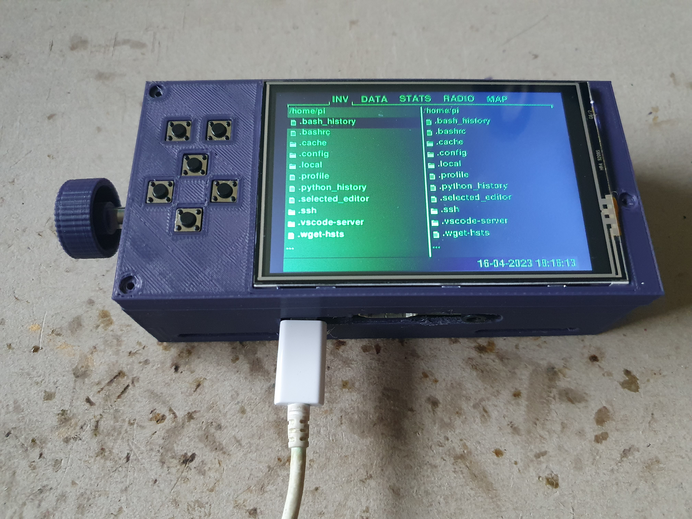
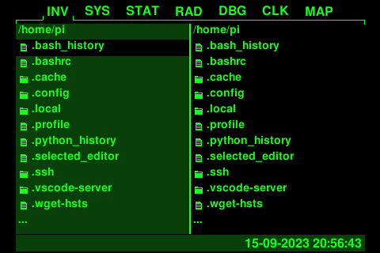
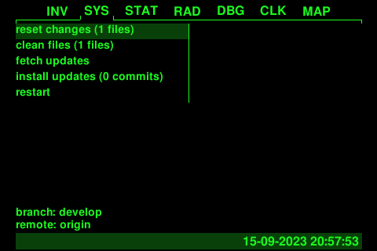
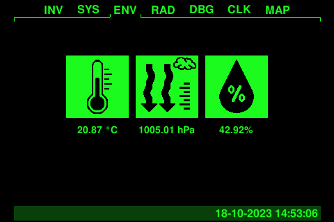
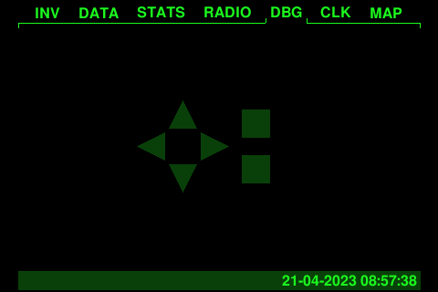
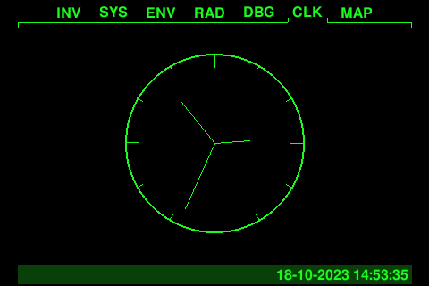
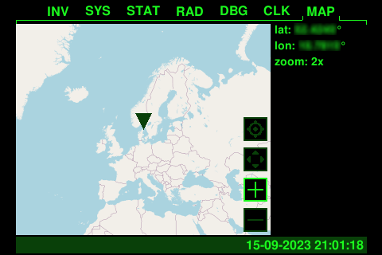

PiBoy
=========================
[](https://github.com/SirLefti/piboy)
[](https://github.com/SirLefti/piboy)

Build your own Pip-Boy with some useful features for real-life using your Raspberry Pi.

## Features

#### File Manager App
Provides basic functions for moving, copying and deleting files and directories. Plug in a USB drive as a holo tape.



#### System App
Can fetch and install updates from the git repository.



#### Environment App
Provides useful information about your environment like temperature, atmospheric pressure and humidity.



#### Radio App
Actually more like a classic music player. Stay tuned!


#### Debug App
Shows the last pressed key to help you check the key wiring.



#### Clock App
It just shows the time on a classic analog clock.



#### Map App
Supports zooming and moving the map around. Don't get lost in the wasteland.



Other shown apps are currently placeholders and not implemented yet.

## Hardware

 - Raspberry Pi (full size board with all 40 pins recommended)
 - 3.5" SPI display module (with an ILI9486 display driver chip)

Additional parts depending on case variant.

## Installation

Install system dependencies:
````bash
sudo apt install build-essential git usbmount python3 python3-dev python3-smbus python3-venv python3-audio fonts-freefont-ttf libjpeg-dev libatlas-base-dev libopenjp2-7-dev
````

Make sure the following entry in ``/lib/systemd/system/systemd-udevd.service`` matches and reboot after changes:
````bash
PrivateMount=no
````

Clone repository and go into it:
````bash
git clone https://github.com/SirLefti/piboy
cd piboy
````

Create a virtual environment:
````bash
python -m venv .venv
````

Install python dependencies:
````bash
.venv/bin/pip install -r requirements-pi.txt
````

Edit the crontab with ``crontab -e`` and add the following:
````bash
@reboot cd /home/pi/piboy && .venv/bin/python piboy.py &
````

To enable logging, use the following instead:
````bash
@reboot cd /home/pi/piboy && (.venv/bin/python -u piboy.py >log 2>err) &
````

To use the hardware input and display, set ``dev_move`` in ``config.yaml`` to `false` (file will be created after first
start).

## Configuration

On first run, the PiBoy script will create a ``config.yaml`` if not found. In that config file, you can configure
everything that relates to appearance and wiring. When running on a Raspberry Pi, ``dev_move`` must be set to ``false``
if not set by default. For development, it must be set to ``true`` instead, obviously. This setting automatically loads
the right input and display modules. On a Raspberry Pi, ``ILI9486Interface`` and ``GPIOInput`` are being used. For
development, ``TkInterface`` or ``SelfManagedTkInterface`` can be used, both implement full input and display
functionality.

You can define additional color groups under ``app_config/modes`` for your own theme and set the index at
``app_config/color_mode``. The first default color group is the traditional class green theme, the second is a yellow
power armor mode theme.

This project uses FreeSansBold as default font. If the font cannot be found despite being installed, or you do not want
to install it, place the ``FreeSansBold.ttf`` in the root directory as a workaround.

## Assembly

See [instructions for prototype 1](./docs/PROTO1.md).

## Roadmap

* [x] display driver
* [x] project base
* [x] build documentation / guide
* [x] case
* [x] file manager app
* [x] map app
* [x] radio app
* [ ] other apps (?)
* [ ] environment sensors (temperature, humidity, ...)
* [ ] GPS module
* [ ] battery power
* [ ] improved case
* [ ] utilities
