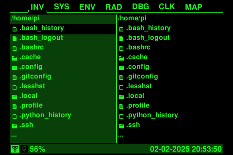
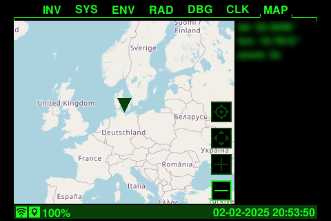

PiBoy
=========================
[](https://github.com/SirLefti/piboy)
[](https://github.com/SirLefti/piboy)
[](https://github.com/SirLefti/piboy)
<br>
[](https://github.com/SirLefti/piboy/tree/develop)
[](https://github.com/SirLefti/piboy/tree/develop)
[](https://github.com/SirLefti/piboy/tree/develop)


Build your own Pip-Boy with some useful features for real-life using your Raspberry Pi.

## Features

#### File Manager App
Provides basic functions for moving, copying and deleting files and directories. Plug in a USB drive as a holo tape.



#### System App
Can fetch and install updates from the git repository.


#### Environment App
Provides useful information about your environment like temperature, atmospheric pressure and humidity.


#### Radio App
Actually more like a classic music player. Stay tuned!


#### Debug App
Shows the last pressed key to help you check the key wiring.


#### Clock App
It just shows the time on a classic analog clock.


#### Map App
Supports zooming and moving the map around. Don't get lost in the wasteland.



## Hardware

Base:
- Raspberry Pi (full size board with all 40 pins recommended)
- Waveshare 3.5" SPI display (or [compatible](http://www.lcdwiki.com/3.5inch_RPi_Display))
- rotary encoder module (KY-040)
- 6x micro push buttons (6 mm x 6 mm)
- proto board (14x9 holes required)
- wires, general soldering stuff
- rotary encoder knob (optional, choose one you like)
- USB Wi-Fi adapter (optional, but recommended if your Pi does not have Wi-Fi onboard)

Modules:
- BME280 environment sensor
- NEO-6M GPS module
- DS3231 RTC clock (optional, but recommended)
- ADS1115 analog-digital converter

Audio:
- PAM8403 amplifier with potentiometer
- 2x Mini Speakers (e.g. Loudity 16 mm or Adafruit Oval 20 mm x 30 mm)
- capacitor ~1000 µF, 10-25 V (optional, but recommended to stabilize power when turning on the PAM8403)
- potentiometer knob (optional, choose one you like)

Battery power:
- MT3608 power converter
- TP4056 battery charging controller
- 18650 battery cell (others can fit as well)
- toggle switch

Additional parts depending on case variant (see [Assembly](#assembly)). Check the following matrix to see which components and component groups are
supported by which case variant. Modules can be skipped entirely, but apps depending on them will not work properly.
Audio can be skipped as well if audio output is not needed. You can also use the audio jack of your Raspberry Pi if it
has one, but not all case provide an opening for it (but you can always make an opening for it). 

### Component Support Matrix

| Component          | Prototype 1 | Prototype 2      | Prototype 3 |
|--------------------|-------------|------------------|-------------|
| BME280             | &cross;     | &check;          | &check;     |
| NEO-6M             | &cross;     | &check;          | &check;     |
| DS3231             | &cross;     | &check;          | &check;     |
| ADS1115            | &cross;     | *see note below* | &check;     |
| Audio Components   | &cross;     | &cross;          | &check;     |
| Battery Components | &cross;     | &check;          | &check;     |

> **NOTE:**<br>
> ADS1115 can be squeezed into prototype 2 as well, but there is no dedicated place for it, and it is not documented.

### Raspberry Pi Model Support

PiBoy can work with models of the Raspberry Pi, that:

* have 40 GPIO pins (which excludes non-plus variants of the first generation)
* support the usual rectangular stand-off grid (which excludes again non-plus variants of the first generation)
* are ideally full width (which excludes all Zero models)
* are ideally full length (which excludes all A+ models and Zero models)

Zero models support only one half of the usual rectangular stand-off grid due to their size, which makes them less
stable in the case than full size models. Official support for Zero models is possible in future case variants. 

Short models like A+ and Zero models will also not reach the end of the case with their IO, Zero models do not even
provide IO on that end. This will prevent you from plugging in USB drives and it will look odd. Apart from that, they
can be used as well.

In short, all models with ethernet and 4x USB are ideal, *BUT* there is one exception: The model 4B swapped the 
positions of the ethernet and USB ports, which requires different structures in the case around the IO. The model 5 went
back to the old layout, and this will most likely be used in future models as well. Prototypes 1 and 2 are using the old
layout as well, making them incompatible with the 4B. Prototype 3 introduces replaceable IO plates to support both
layouts. You can also design your own IO plate to make it compatible with other single board computers, that have a
completely different IO layout.

## Installation

All guides are using Raspberry OS based on Debian Bookworm.

Install system dependencies:
````bash
sudo apt install git libopenjp2-7 libportaudio2 libopenblas0 python3-rpi-lgpio fonts-freefont-ttf
````

Call `sudo raspi-config`, select `Interface Options > SPI` and choose `Yes` to enable SPI.
Then select `Interface Options > I2C` and choose `Yes` to enable I2C.
Then also select `Interface Options > Serial Port` and choose `No` in the first pop-up and `Yes` in the second
pop-up. The last pop-up should then inform you, that the serial login shell is disabled and the serial interface is
enabled.

Clone repository and go into it:
````bash
git clone https://github.com/SirLefti/piboy
cd piboy
````

Create a virtual environment:
````bash
python -m venv .venv
````

Install python dependencies:
````bash
.venv/bin/pip install -r requirements-pi.txt
````

Now head over to the [module specific instructions](#module-specific-instructions) section and check the instructions of
each module you want to use. Some of them require additional steps to make them work. They all provide information to
validate that the module is configured and wired correctly.

Create a systemd service in ``/etc/systemd/system/piboy.service``:
````ini
[Unit]
Description=PiBoy Python Script
After=network.target

[Service]
Type=simple
WorkingDirectory=/home/pi/piboy
ExecStart=/home/pi/piboy/.venv/bin/python -u /home/pi/piboy/piboy.py
StandardOutput=file:/home/pi/piboy/log
StandardError=file:/home/pi/piboy/err
Restart=on-failure
User=pi
Group=pi

[Install]
WantedBy=multi-user.target
````

Reload to get the new configuration:
````bash
sudo systemctl daemon-reload
````

Activate the new service:
````bash
sudo systemctl enable piboy.service
````

Either restart the Pi or start the service manually:
````bash
sudo systemctl start piboy.service
````

## Configuration

On first run, the PiBoy script will create a ``config.yaml`` if not found. In that config file, you can configure
everything that relates to appearance and wiring. When running on a Raspberry Pi, ``dev_move`` must be set to ``false``
if not set by default. For development, it must be set to ``true`` instead, obviously. This setting automatically loads
the right input and display modules. On a Raspberry Pi, ``ILI9486Display`` and ``GPIOInput`` are being used. For
development, ``TkInteraction`` or ``SelfManagedTkInteraction`` can be used, both implement full input and display
functionality.

You can define additional color groups under ``app_config/modes`` for your own theme and set the index at
``app_config/color_mode``. The first default color group is the traditional classic green theme, the second is a yellow
power armor theme.

This project uses FreeSansBold as default font. If the font cannot be found despite being installed, or you do not want
to install it, place the ``FreeSansBold.ttf`` in the root directory as a workaround.

## Assembly

See [instructions for prototype 1](docs/prototype1/ASSEMBLY.md).

See [instructions for prototype 2](docs/prototype2/ASSEMBLY.md).

### Module specific instructions

* [BME280 environmental sensor](./docs/BME280.md)
* [DS3231 RTC clock](./docs/DS3231.md)
* [NEO-6M GPS module](./docs/NEO-6M.md)
* [ADS1115 analog-digital converter](./docs/ADS1115.md)
* [KY-040 rotary encoder](./docs/rotary-encoder.md)
* [Keypad](./docs/keypad.md)

## Post-Install

### Wi-Fi connection

You might want to add another Wi-Fi connection, e.g. to your phone, when you are out of your homes Wi-Fi range. Get in
the range of the Wi-Fi you want to add and check, if your device can see it:
````bash
nmcli dev wifi
````
If your Wi-Fi is not found immediately, wait a bit and run the command again.

If it was found, you can configure the connection (replace `<wifi-ssid>` and `<wifi-password>`):
````bash
sudo nmcli dev wifi connect <wifi-ssid> password <wifi-password>
````
When you were connected via `ssh`, the connection might reset due to the network change.

Network configurations are saved at `/etc/NetworkManager/system-connections`. Refer to the documentation of `nmcli` for
further details.

## Roadmap

* [x] display driver
* [x] project base
* [x] build documentation / guide
* [x] case
* [x] file manager app
* [x] map app
* [x] radio app
* [x] environment sensors (temperature, humidity, ...)
* [x] GPS module
* [x] battery power
* [x] speaker for radio app
* [x] battery status
* [x] auto-mount usb drives
* [ ] improved case

## Issues

### PyAudio

`pyaudio` might require system dependencies to be installed. On macOS, install the `portaudio` dependency with MacPorts:
```bash
sudo port install portaudio
```
Then install the package with pip and pass the directories where to find the dependencies:
```bash
CFLAGS="-I/opt/local/include -L/opt/local/lib" .venv/bin/pip install pyaudio
```
