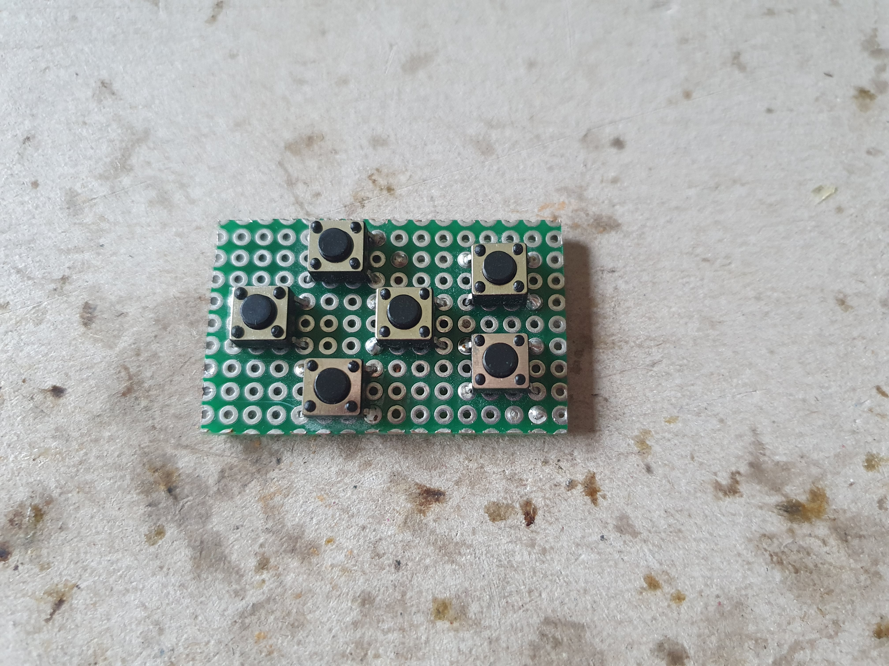
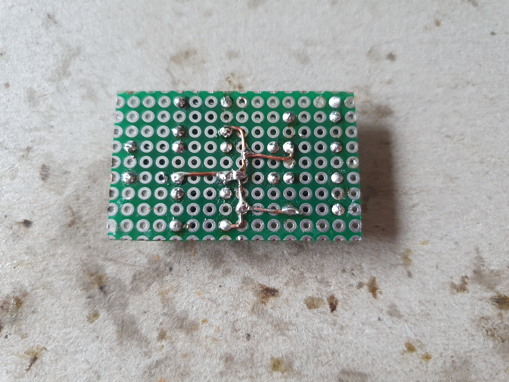

Keypad
======

The keypad uses six micro push buttons for a simple d-pad and two additional buttons.

## Parts
* 6x micro push buttons
* perf board/proto board (14x9 holes required)
* wires, general soldering stuff

## Assembly

Mount and solder the micro push buttons as shown.

Solder a common ground wire.

Cut the edges of the board if it is too big to fit.

**NOTE:** As you can see, a single button needs 3x4 holes and has four legs, with two legs being connected to each other
internally. To connect each button to the Pi, use the leg of the button, that is just **one** hole apart from that one,
that is connected to the common ground wire. It might feel more intuitive to you to use the one, that is **two** holes
apart from the common ground wire, and I did this mistake several times as well. It is the other one. It does not damage
the Pi when it is soldered the wrong way, it is just not working.

## Wiring

| Keypad Pin   | Raspberry Pi Pin |
|--------------|------------------|
| GND          | GND              |
| button UP    | GPIO 5           |
| button DOWN  | GPIO 6           |
| button LEFT  | GPIO 12          |
| button RIGHT | GPIO 13          |
| button A     | GPIO 16          |
| button B     | GPIO 26          |
