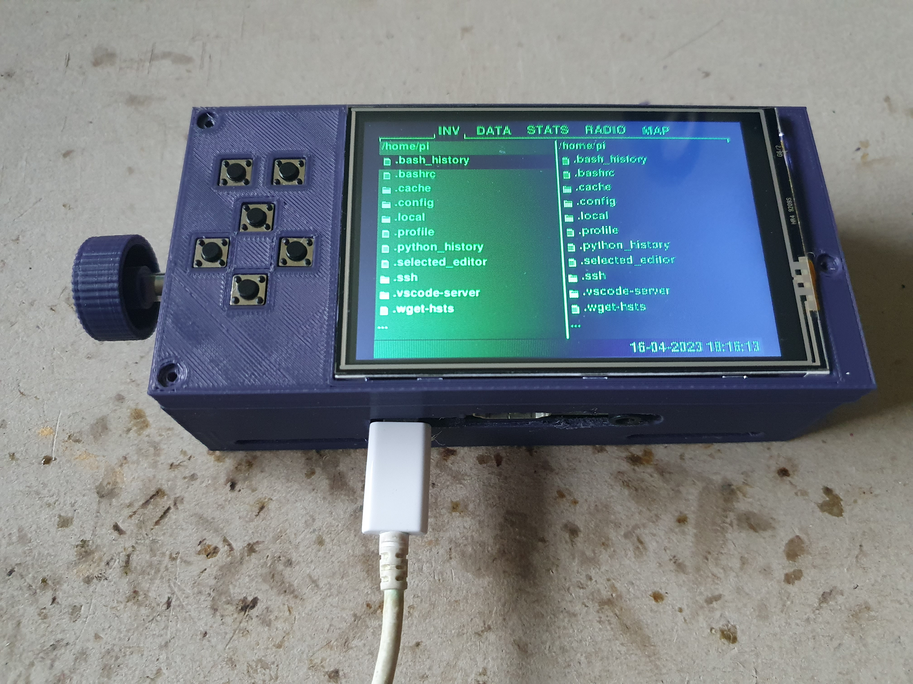
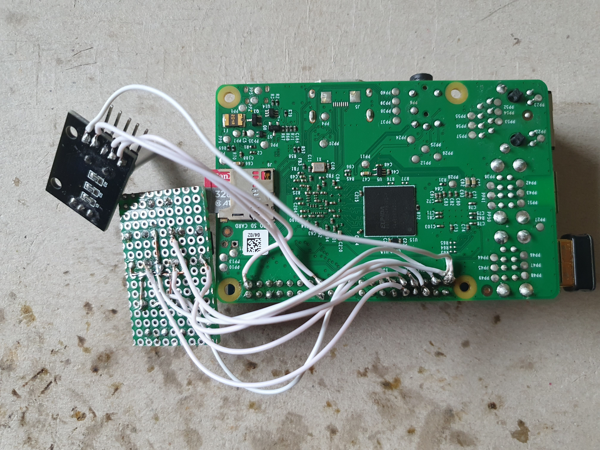
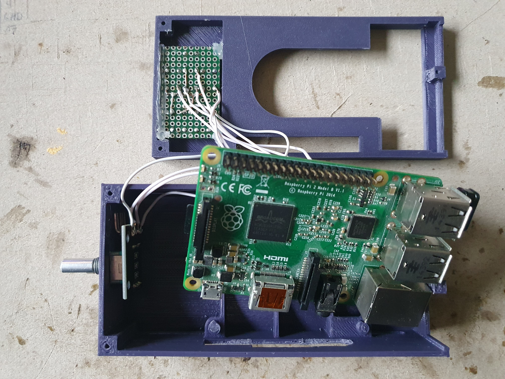
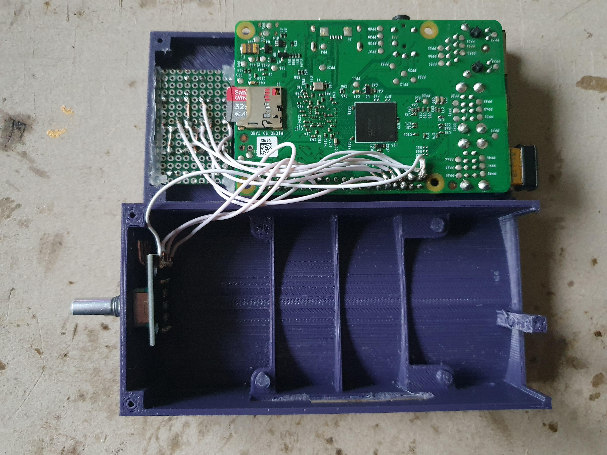

Case Prototype 1
================

## Parts
* [base part](parts/Proto1.1-base.stl)
* [top part](parts/Proto1.1-top.stl)
* 3x M2x25

**Made for Raspberry Pi 2 Model B. Other full size boards should fit as well with some adjustments to the I/O part.**

## Goal

* minimalistic case as a proof of concept
* test button position and alignment
* test bulge for forearm
* test space for a potential strap
* test printing and removing support structures
* no extra space for extra hardware modules or battery

## Evaluation

* forearm bulging requires huge support structure, maybe just make it flat or introduce a separate part and print it
upside down
* support posts for the pi board also require support structures beneath, because a strap should go underneath
* screw holes are pretty tight, but might allow to omit nuts
* hole for rotary encoder is a bit tight
* might need a custom knob which is flush with the case
* knob might be too close to your forearm, depending on its size
* misplaced support posts for Pi board
* missing cutout for audio jack
* SMDs under the display module might interfere
* right screw post blocks USB ports

### Fixes in Prototype 1.1

* added cutout for audio jack
* fixed misplaced support posts
* less tight screw holes in top part
* removed/shortened screw post on the right side

## Instructions

### 1. Prepare parts

The first version of the 3d-printed parts have some issues. There is no cutout for the audio jack and the support posts
for the Pi board are misplaced. 

Solder the [keypad](../keypad.md) as described, and prepare the config for the [rotary encoder](../rotary-encoder.md).

### 2. Solder to Pi board

Solder wires to the bottom of the Pi board to connect the daughter board and rotary encoder. 

| #pin | pin name  | connects                       |
|------|-----------|--------------------------------|
| 1    | 3v3 power | rotary encoder +               |
| 15   | GPIO 22   | rotary encoder CLK             |
| 16   | GPIO 23   | rotary encoder DT              |
| 29   | GPIO 5    | button UP                      |
| 31   | GPIO 6    | button DOWN                    |
| 32   | GPIO 12   | button LEFT                    |
| 33   | GPIO 13   | button RIGHT                   |
| 36   | GPIO 16   | button A                       |
| 37   | GPIO 26   | button B                       |
| 39   | GND       | rotary encoder GND, button GND |

Keep in mind, that wiring diagrams and pinouts for the Pi are usually from a top view, which means you have mirror the
pinout, as seen in the image.

### 3. Assembly

Mount the rotary encoder and glue in the daughter board (I used hot glue due to the gaps).

Flip the Pi board and attach the display module.

Put both parts together. Add a knob if you have and use screws to hold the parts in place.
