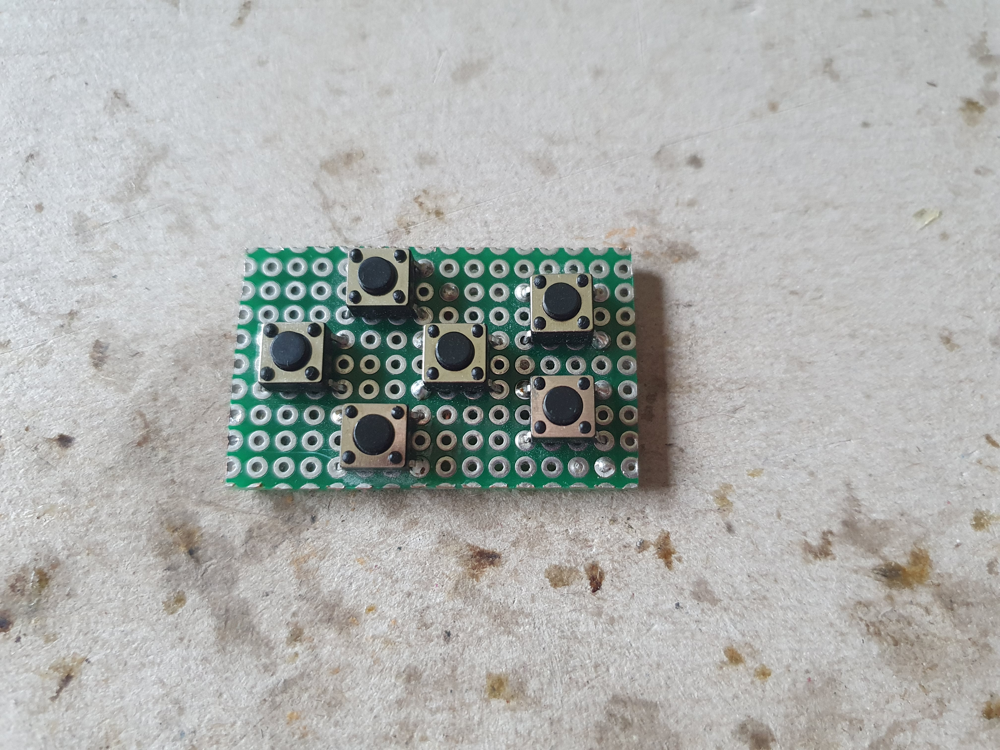
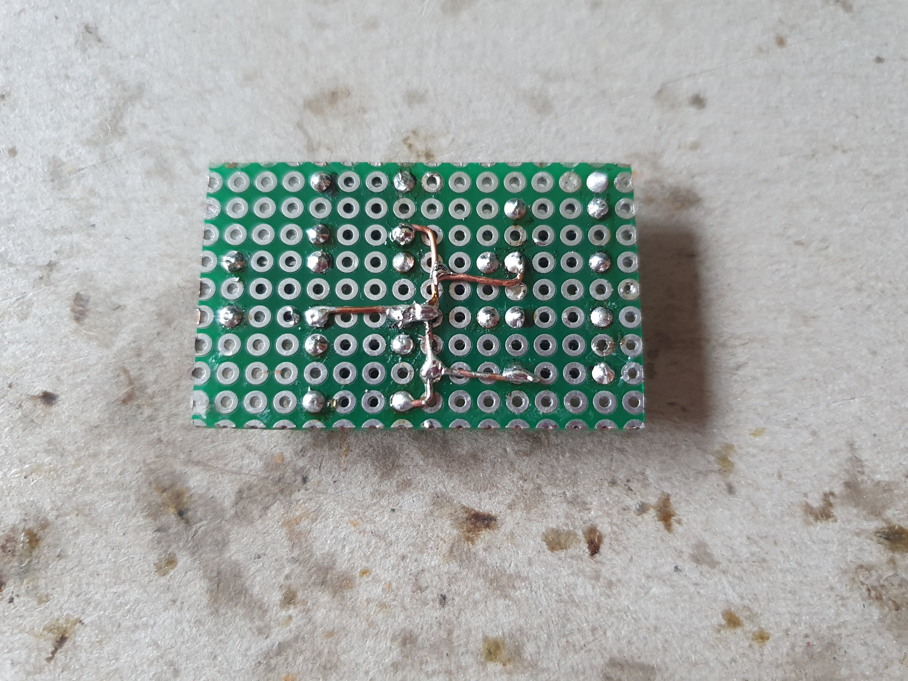

Case Prototype 1
================

## Parts
* [base part](parts/Proto2.1-base.stl)
* [carrier part](parts/Proto2.1-carrier.stl)

either for type A:
* [spacer part](parts/Proto2-Proto2.1-spacer.stl)
* [top part](parts/Proto2.1-top.stl)
* [GPIO edge extension](https://wiki.52pi.com/index.php?title=EP-0121)

or for type B:
* [top part no spacer](/prototype2/parts/Proto2.1-top-no-spacer.stl)

and also for both types:
* 8x M2x25 (might require to shorten some screws a bit, also depending on the type)

**Made for Raspberry Pi 2 Model B. Other full size boards should fit as well with some adjustments to the I/O part.**

## Goal

* make everything fit inside
* test component layout

## Evaluation

* forearm bulging radius is probably too wide for most arms to be comfortable
* hole for power switch is pretty tight, might be hard to mount the switch
* mounting rails for MT3608 is pretty tight
* display might need additional support from the bottom
* misplaced stand-offs for NEO-6M
* malformed stand-offs for DS3231

### Fixes in Prototype 2.1

* widened hole for power switch for easier mounting
* widened mounting rails for MT3608
* additional support for display
* fixed misplaced stand-offs for NEO-6M
* fixed malformed stand-offs for DS3231

## Building

### 1. Prepare parts

The first version of these parts had a few issues. Use the parts with ``Proto2.1`` in their name instead. Some parts
might still need some sanding and smoothing, especially on the mounting rails. 

### 2. Solder daughter board

This is the same as from prototype 1 and can be reused.

Mount and solder the micro push buttons as shown.

Solder a common ground wire.

Cut the edges of the board if it is too big to fit.

### 3. Solder to Pi board

If you chose type A (includes the spacer), you can solder everything to the extra GPIO extension, or even use jumper
wires to connect the components. If you chose type B (more compact) instead, you have to solder the wires directly to
bottom of the Pi.

| #pin | pin name  | connects                       |
|------|-----------|--------------------------------|
| 1    | 3v3 power | rotary encoder +               |
| 15   | GPIO 22   | rotary encoder CLK             |
| 16   | GPIO 23   | rotary encoder DT              |
| 29   | GPIO 5    | button UP                      |
| 31   | GPIO 6    | button DOWN                    |
| 32   | GPIO 12   | button LEFT                    |
| 33   | GPIO 13   | button RIGHT                   |
| 36   | GPIO 16   | button A                       |
| 37   | GPIO 26   | button B                       |
| 39   | GND       | rotary encoder GND, button GND |

Keep in mind, that wiring diagrams and pin-outs for the Pi are usually from a top view, which means you have mirror the
pinout. Some wires might need to go through the middle of the carrier part.

Do the same for [DS3231](../DS3231.md) and [NEO-6M](../NEO-6M.md), as described in their instructions.

TODO: power converter, battery

### 4. Assembly

The parts are held in place in different ways. If needed, add some (more) hot glue.

| part           | mounting            |
|----------------|---------------------|
| Raspberry Pi   | stand-offs          |
| display        | GPIO pins           |
| rotary encoder | mounting hole (nut) |
| daughter board | hot glue            |
| TP4056         | hot glue            |
| MT3508         | mounting rail       |
| battery        | hot glue / tape     |
| toggle switch  | mounting hole (nut) | 
| NEO-6M module  | stand-offs          |
| NEO-6M antenna | mounting rail       |
| DS3231         | stand-offs          |
| BME280         | hot glue            |

TODO: images and descriptions
