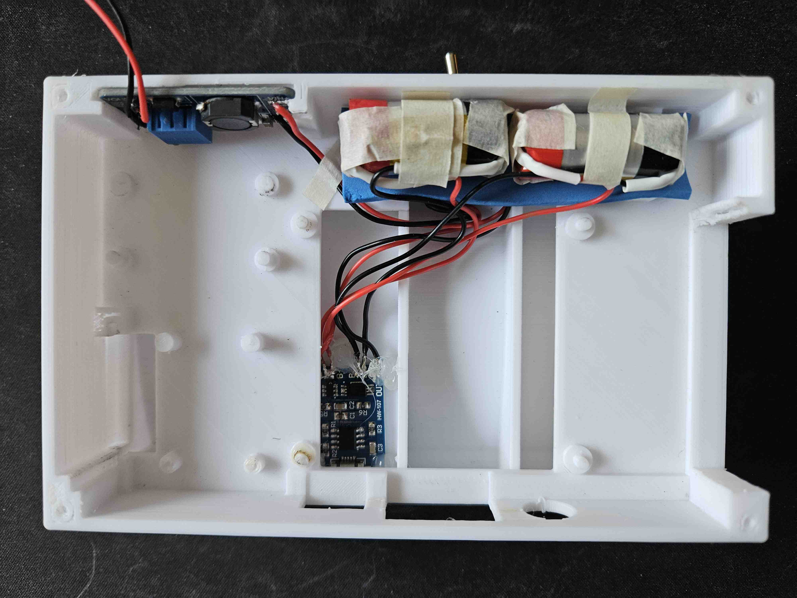
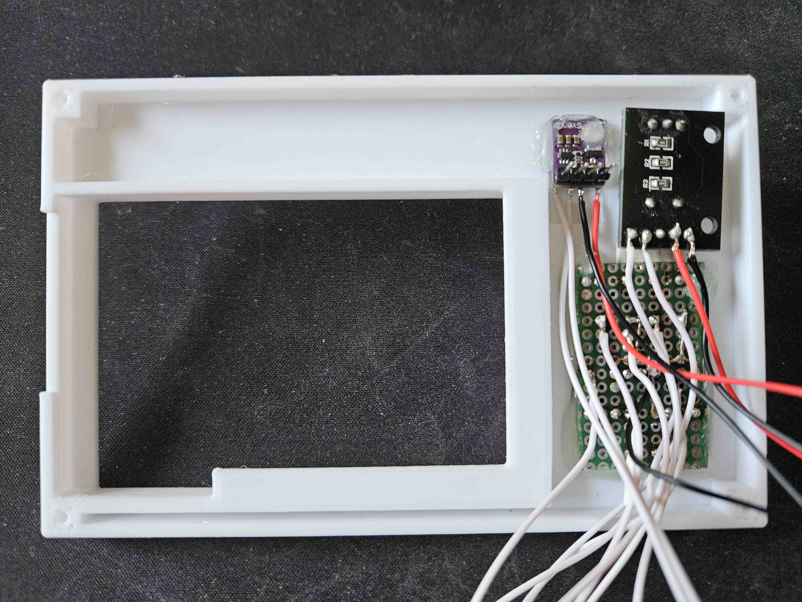
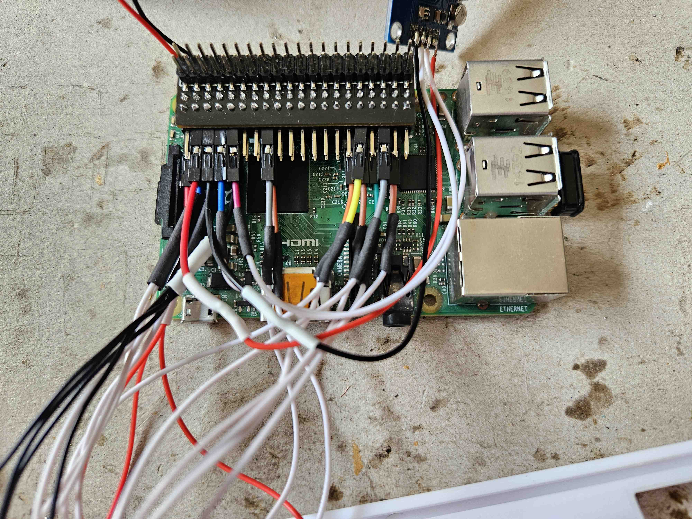
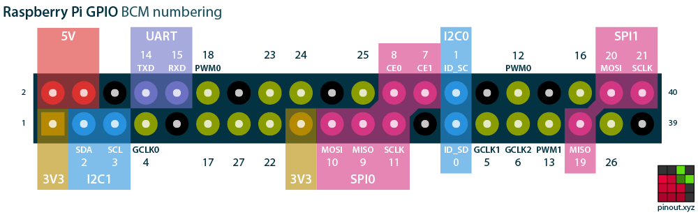
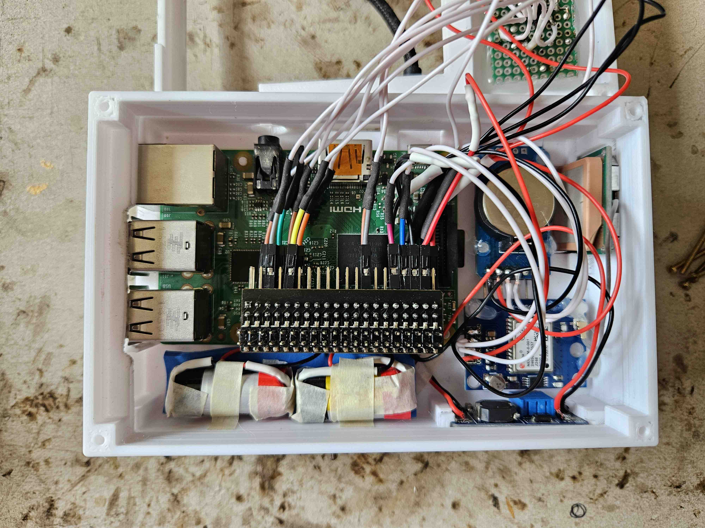

Case Prototype 2
================

## Parts
* [base part](parts/Proto2.1-base.stl)
* [carrier part](parts/Proto2.1-carrier.stl)

either for type A:
* [spacer part](parts/Proto2.1-spacer.stl)
* [top part](parts/Proto2.1-top.stl)
* [GPIO edge extension](https://wiki.52pi.com/index.php?title=EP-0121)

or for type B:
* [top part no spacer](/prototype2/parts/Proto2.1-top-no-spacer.stl)

and also for both types:
* 8x M2 (you can shorten screws if needed)
  * 4x at least 16 mm for the bottom
  * 4x at least 24 mm for the top for type A or 12 mm for type B

**Made for Raspberry Pi 2 Model B. Other full size boards should fit as well with some adjustments to the I/O part.**

## Goal

* make everything fit inside
* test component layout

## Evaluation

* forearm bulging radius is probably too wide for most arms to be comfortable
* more space to run wires through would be helpful
* hole for power switch is pretty tight, might be hard to mount the switch
* hole for rotary encoder is pretty tight
* mounting rails for MT3608 is pretty tight
* display might need additional support from the bottom
* misplaced stand-offs for NEO-6M
* USB ports need a bit more space
* spacer for type A is not tall enough for the extension unit
* antenna position is suboptimal

### Fixes in Prototype 2.1

* widened hole for power switch for easier mounting
* widened hole for rotary encoder
* widened mounting rails for MT3608
* additional support for display
* fixed misplaced stand-offs for NEO-6M
* more space for USB ports
* higher spacer part

## Instructions

### 1. Prepare parts

The first version of these parts had a few issues. Use the parts with ``Proto2.1`` in their name instead.
The image shows the parts for type A. The top left part is slightly different for type B and does not use the top right
part.

This is how the components are being placed. Make sure everything fits nicely before soldering. Some parts might still
need some sanding and smoothing, especially on the mounting rails.

The screws should grip into the four holes in the carrier part that holds the Pi and most of the other components, but
slip through the holes in the other parts. Screws will be placed from the bottom as well as from the top, and might need
to be shortened a bit. Going from both sides reduces the load on each screw and allows to use shorter screws, because
25 mm is usually already the longest variant you can get for M2 screws, which would not be enough here if going from the
top all the way to the bottom part.

Solder the [keypad](../keypad.md) as described, and prepare the config for the [rotary encoder](../rotary-encoder.md).

### 2. Solder power circuit

For the power circuit, you need the battery, charging controller, switch and power converter. Solder them together as
show in the table and image below.

**IMPORTANT:** Set up the power converter to output 5.0 V before soldering the Pi to it. The Pi has no fuses to protect
itself from over-voltage via the pins. Charge the battery before configuring it.

**NOTE**: The switch is placed between the battery/charging controller and the power converter, because the power
converter would drain the battery over time if it was permanently connected to it.

| from          | to              |
|---------------|-----------------|
| battery+      | TP4056 B+       |
| battery-      | TP4056 B-       |
| TP4056 Out+   | Switch Center 1 |
| TP4056 Out-   | Switch Center 2 |
| Switch Left 1 | MT3608 VIn+     |
| Switch Left 2 | MT3608 VIn-     |
| MT3608 VOut+  | Pi Pin 2 (5V)   |
| MT3608 VOut-  | Pi Pin 6 (GND)  |

The complete circuit should look like this. Try to power it on like that to see if everything works. Also attach the
display module, because it has a relatively high power draw compared to the other components.

*Note: I am using here two separate cells instead of the single 18650 one. If using two separate cells, make sure they
are of the same type and have the same rated capacity.*

### 3. Assembly

The parts are held in place in different ways. If needed, add some (more) hot glue.

| part           | mounting            |
|----------------|---------------------|
| Raspberry Pi   | stand-offs          |
| display        | GPIO pins           |
| rotary encoder | mounting hole (nut) |
| daughter board | hot glue            |
| TP4056         | hot glue            |
| MT3508         | mounting rail       |
| battery        | hot glue / tape     |
| toggle switch  | mounting hole (nut) | 
| NEO-6M module  | stand-offs          |
| NEO-6M antenna | mounting rail       |
| DS3231         | stand-offs          |
| BME280         | hot glue            |

* mount the toggle switch in the bottom part
* glue in the charging controller
* place the battery
* mount the MT3508 power converter
  * grind away the rest of the pins on the bottom of the board, if needed
* screw both parts together from the bottom

* mount the rotary encoder
* glue in the keypad
* glue in the BME280 environment sensor

Depending on the variant, solder all wires to the Pi as referenced, or connect them to the edge extension. Using the
extension makes it much easier, especially because there is not much space under the Pi for cable management.

Configure [BME280](../BME280.md), [DS3231](../DS3231.md) and [NEO-6M](../NEO-6M.md), as described in their instructions.

You can bundle multiple GND and VCC wires together. The I2C devices (DS3231 and BME280) also share the same pins.

Use this table for reference:

| #pin | pin name          | connects                                       |
|------|-------------------|------------------------------------------------|
| 1    | 3v3 power         | KY-040 +, BME280 VIn, DS3231 VCC               |
| 2    | 5v power          | MT3608 VOut+                                   |
| 3    | GPIO 2 / I2C SDA  | BME280 SDA, DS3231 SDA                         |
| 4    | 5v power          | NEO-6M VCC                                     |
| 5    | GPIO 3 / I2C SCL  | BME280 SCL, DS3231 SCL                         |
| 6    | GND               | MT3608 VOut-, NEO-6M GND                       |
| 8    | GPIO 14 / UART TX | NEO-6M RX                                      |
| 9    | GND               | KY-040 GND, keypad GND, BME280 GND, DS3231 GND |
| 10   | GPIO 15 / UART RX | NEO-6M TX                                      |
| 13   | GPIO 27           | KY-040 SW / NC                                 |
| 15   | GPIO 22           | KY-040 CLK                                     |
| 16   | GPIO 23           | KY-040 DT                                      |
| 29   | GPIO 5            | keypad UP                                      |
| 31   | GPIO 6            | keypad DOWN                                    |
| 32   | GPIO 12           | keypad LEFT                                    |
| 33   | GPIO 13           | keypad RIGHT                                   |
| 36   | GPIO 16           | keypad A                                       |
| 37   | GPIO 26           | keypad B                                       |

Refer to this pinout diagram from [pinout.xyz](https://pinout.xyz/):

Keep in mind, that wiring diagrams and pinouts for the Pi are usually from a top view, which means you have mirror the
pinout when soldering to the bottom. Some wires might need to go through the middle of the carrier part.

Put all components inside and add some hot glue if needed. Remember to also add the spacer part when using the edge
extension.

Place the top part on top and secure it with screws.
