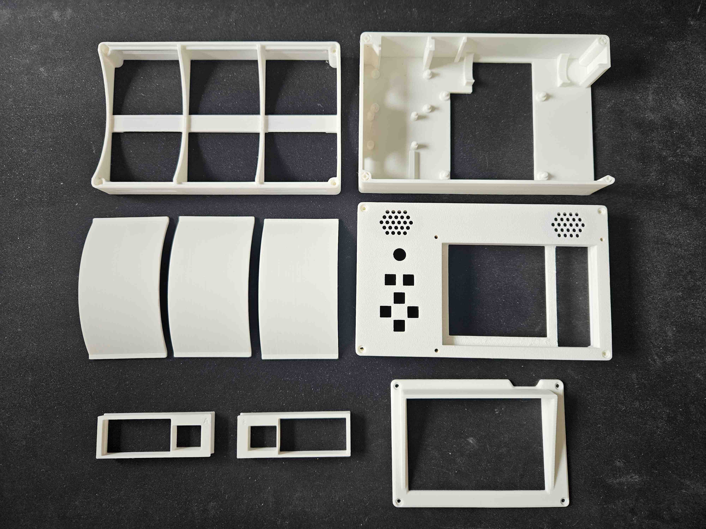
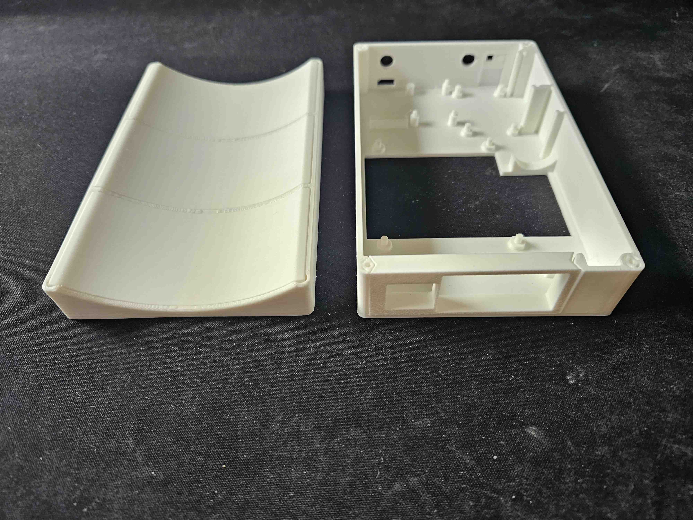
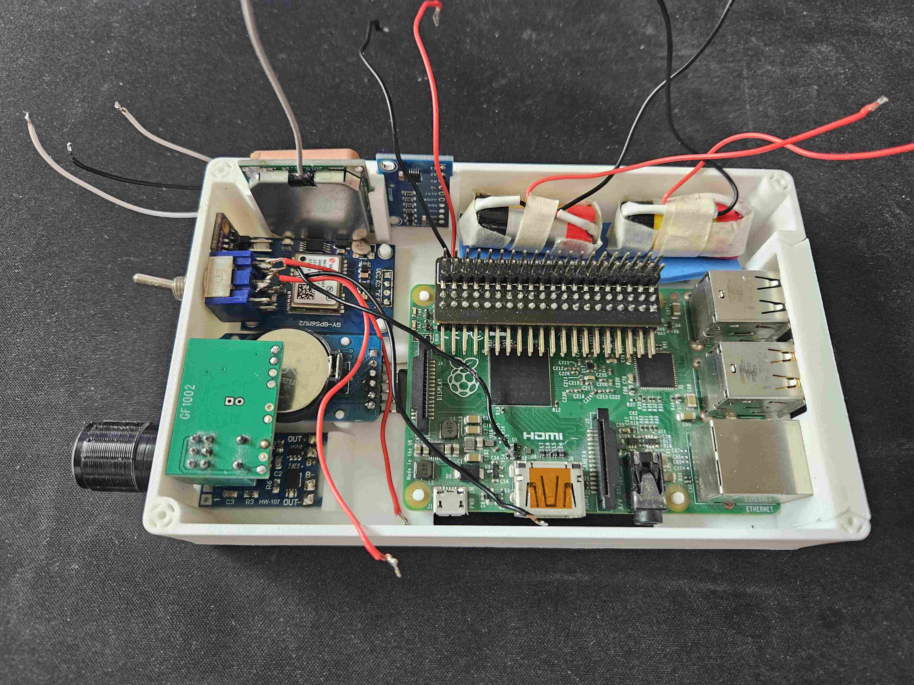
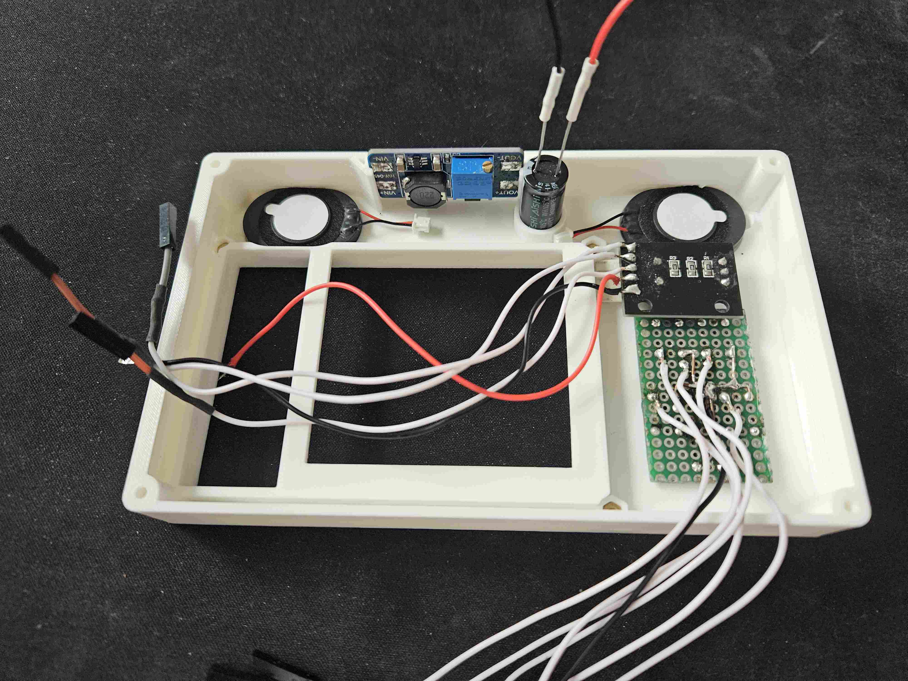
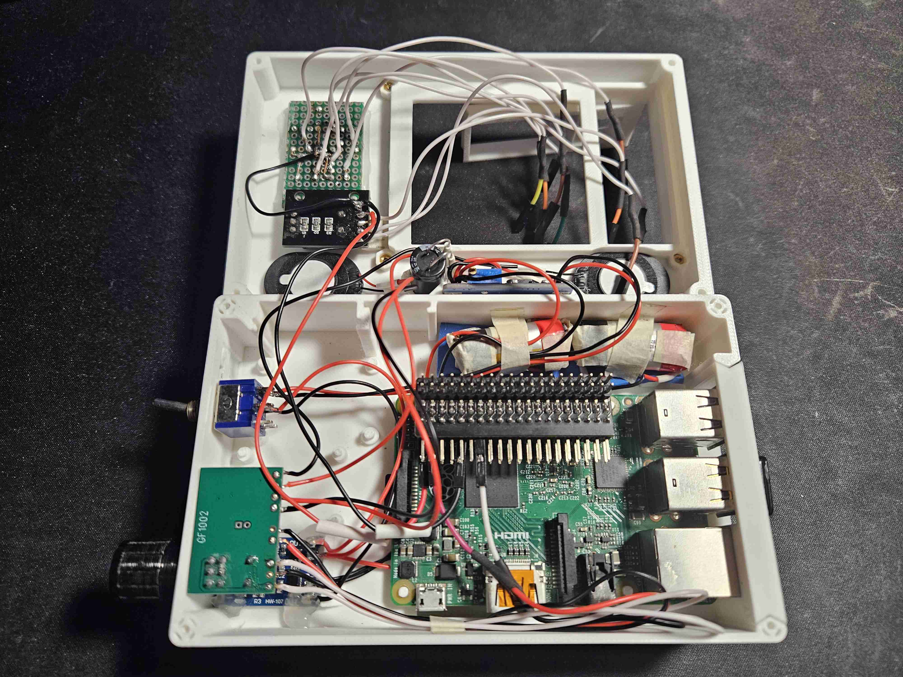
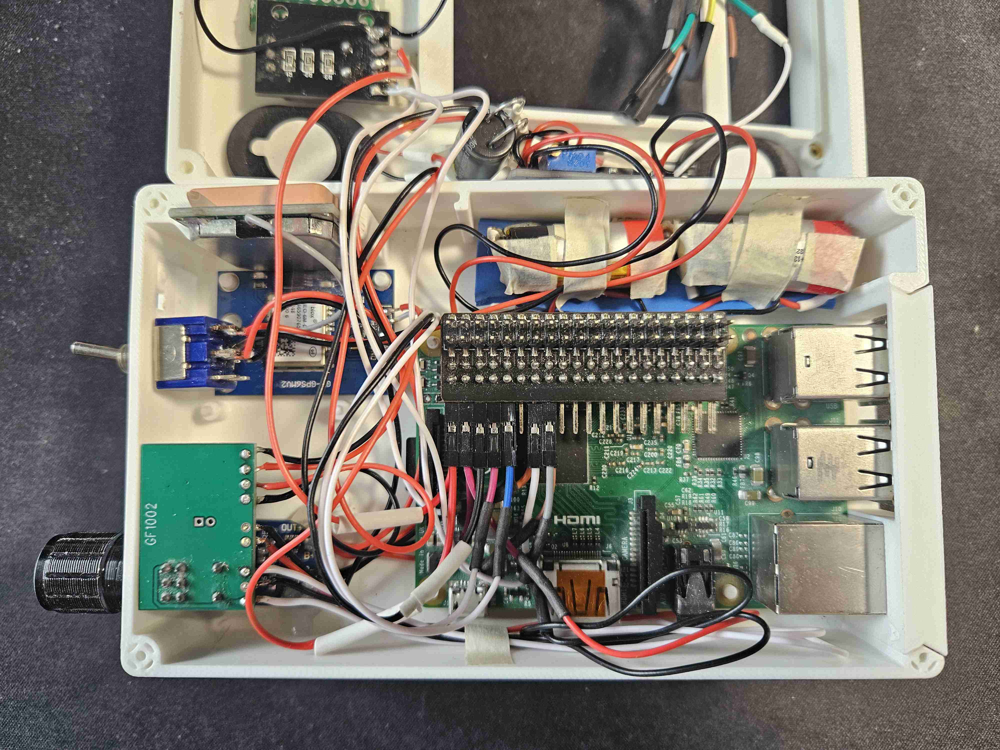
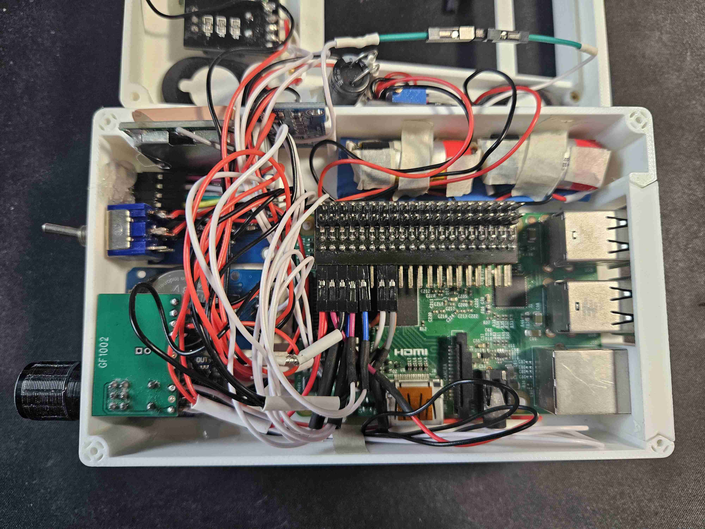
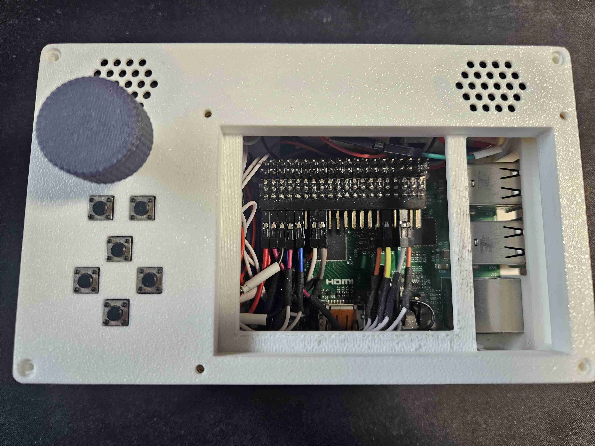
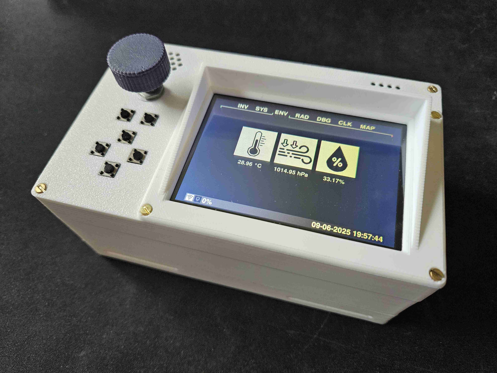

Case Prototype 3
================

## Parts
* 1x [base frame part](parts/Proto3-part-base-frame.stl)
* 3x [base arch part](parts/Proto3-part-base-arch-3x.stl)
* 1x [carrier part](parts/Proto3-part-carrier.stl)
* 1x [top part](parts/Proto3-part-top.stl)
* 1x [glare shield](parts/Proto3-part-glare-shield.stl)
* 8x M2x25 screws
* 3x M2x10 screws + nuts

either for Raspberry Pi 2B, 3B or 5:
* 1x [IO plate for RPi 2B, 3B and 5](parts/Proto3-pi-2-3-5-plate.stl)

or for Raspberry Pi 4B:
* 1x [IO plate for RPi 4B](parts/Proto3-pi-4-plate.stl)

or your own designed one if you use a different single board computer.

There is also an alternative [optimized carrier part](parts/Proto3-part-carrier-optimized.stl), that has some print
optimizations around the screw holes to ensure enough structural strength while avoiding too much slicer optimization.
Use it only if your 3D printer is capable of such fine structures or use the normal part from the list above instead.

## Instructions

### 1. Prepare parts

The three arches are all the same. They will most likely require some sanding to fit perfectly flush.
You will need only one of the IO plates on the bottom left.
The glare shield can technically be skipped if you do not wish to use it.

Make sure the arches fit into the base frame and are held in place by friction. The middle one can be glued in if
needed, but the outer ones have to be removable, because they cover the bottom screws.

The IO plate for your Raspberry Pi should loosely fit into the designated space. The identifying letter on the IO plate
should face to the inside.

This is how the components are being place in the carrier part. Make sure everything fits nicely before soldering.

And this is how the components are being placed in the top part. Also make sure everything fits nicely here. Insert
three M2 nuts into the designated spaces around the screen cutout. If it is too tricky, try inserting a screw from the
other side, adding the nut to its end, and pulling out the screw to squeeze the nut into its place. Add some glue to be
sure they are fixed in place.

The screws should grip into the holes in the carrier part, but slip through the holes in the base frame and top part.

Solder the [keypad](../keypad.md) and [power circuit](../power-circuit.md) as described, and prepare the config for the
[rotary encoder](../rotary-encoder.md).

### 2. Assembly

Now comes the funny part. Take your time, because some of the next steps can be tricky. 

The first one is still easy. Place the base frame under the carrier part and use four long screws to secure it. Then put
the arch parts in place.

#### 2.1 Power, Controls and Audio

Continue with the essentials, and everything that is soldered directly.

* [power circuit](../power-circuit.md)
  * solder the output of the voltage converter to the bottom of the Pi
  * solder a wire to the VIN+ of the voltage converter in preparation for [ADS1115](../ADS1115.md)
  * mount the voltage converter
  * hot-glue the capacitor next to the voltage converter
  * secure the battery with some tape
  * screw in the switch
* [PAM8403](../PAM8403.md)
  * if you choose input variant A, solder the audio lines to the bottom of the Pi
  * if you choose input variant B, connect via GPIO pins
  * mount the speakers
  * screw in the amplifier module
  * connect the wires to the Pi
* [rotary encoder](../rotary-encoder.md)
  * screw in the rotary encoder module
  * connect the wires to the Pi
* [keypad](../keypad.md)
  * hot-glue the keypad in place
  * connect the wires to the Pi (you can pigtail ground to the rotary encoders ground)

#### 2.2 GPS

Now add the GPS. The antenna should face outwards.

* [NEO-6M](../NEO-6M.md)

#### 2.3 Environment sensor, RTC and ADC

Finally add the modules, that are connected via I2C.

* take a look at the module specific instructions and make sure every module works on its own
  * [BME280](../BME280.md)
  * [DS3231](../DS3231.md)
  * [ADS1115](../ADS1115.md)
* due to limited pins providing 3.3 V, prepare a common VCC connector, that connects [BME280](../BME280.md),
  [DS3231](../DS3231.md) and also the [rotary encoder](../rotary-encoder.md) (double check if you module states it needs
  5 V instead)
* similarly, prepare common SDA and SCL connectors, that connect the SDA and SCL pins of [BME280](../BME280.md),
  [DS3231](../DS3231.md) and [ADS1115](../ADS1115.md), because I2C is a bus system that shares the same wire across all
  devices
* you can do the same for ground, but it is not necessarily needed, because there are enough ground pins available on
  the Pi
* mount the RTC module (might need to add some hot-glue)
* mount the ADC module
* hot-glue the environment sensor in place

#### 2.4 Finish

Congratulations. If everything works at this point, you have now reached the final step, which is an easy one. Place the
top part on top and secure it with the longer screws in all corners except the bottom right one. Then add the glare
shield, use the last long screw in the bottom right corner, and the shorter ones in the other corners of the glare
shield.

